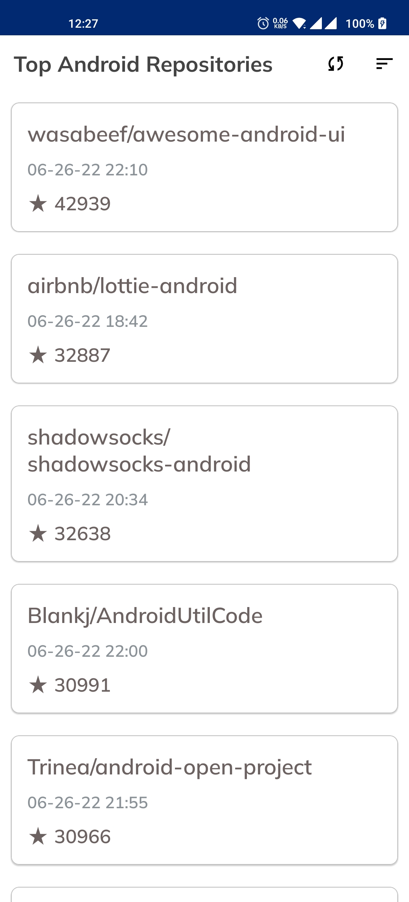
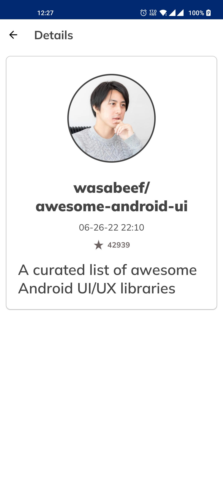

# [Top Android Repositories](https://github.com/samiulhoquelimo/Top-Android-Repositories)

**Top Android Repositories** a test application which shows the top 50 top most starred github
repositories by searching with the "Android" keyword.

## The app has following packages

1. **data**: It contains all the data accessing and manipulating components.
2. **di**: Dependency providing classes using Dagger2.
3. **ui**: View classes along with their corresponding Presenters.
4. **service**: Services for the application.
5. **utils**: Utility classes.

## What's inside the app

- Architecture: [MVP](https://github.com/MindorksOpenSource/android-kotlin-mvp-architecture) (Model
  View Presenter)


- App is written in [Kotlin](https://developer.android.com/kotlin)

## Project Structure

```text
com.brainstation23.topandroidrepositories     # Root Package
    .
    ├─ data                     # Data handling
    |   ├─ database             # Room database for local caching
    |   |  └─ repository        # Entities and data classes
    |   ├─ network              # Fast Android Networking for remote api calling
    |   |  ├─ request           # Request class that holds api request body
    |   |  └─ response          # Data class that holds api response
    |   └─ preference           # Shared Preferences Provider
    |
    ├─ di                       # Dependency Injection (Dagger)
    |
    ├─ service                  # Application class and Initializer
    |
    ├─ ui                       # View layer (Activity, Fragments)
    │   ├─ base                 # Base class for Activity and Fragment
    │   └─ home                 # Home Screen Activity
    │      └─ view
    │         └─ fragment
    │            ├─ details     # Details Fragment for details page
    │            └─ home        # Home Fragment for main page
    |
    └─ utils                    # Extensions, Utility and Constants classes
```

## Inspired by [Android-Kotlin-MVP-Architecture](https://github.com/MindorksOpenSource/android-kotlin-mvp-architecture) (MindorksOpenSource)

## Libraries used in App

- [Room Database](https://developer.android.com/training/data-storage/room)
- [Fast Android Networking](https://github.com/amitshekhariitbhu/Fast-Android-Networking)
- [RxAndroid](https://github.com/ReactiveX/RxAndroid)
- [RxJava](https://github.com/ReactiveX/RxJava)
- [Dagger](https://github.com/google/dagger)
- [Picasso](https://github.com/square/picasso)
- [Stetho](https://github.com/facebook/stetho)
- [SDP](https://github.com/intuit/sdp)
- [SSP](https://github.com/intuit/ssp)
- [Toasty](https://github.com/GrenderG/Toasty)
- [Timber](https://github.com/JakeWharton/timber)
- [Circle Image View](https://github.com/hdodenhof/CircleImageView)

## Screenshots 📸
[](https://github.com/samiulhoquelimo/Top-Android-Repositories/blob/main/readme/screenshot_1.jpg)
[](https://github.com/samiulhoquelimo/Top-Android-Repositories/blob/main/readme/screenshot_2.jpg)
[](https://github.com/samiulhoquelimo/Top-Android-Repositories/blob/main/readme/screenshot_3.jpg)
